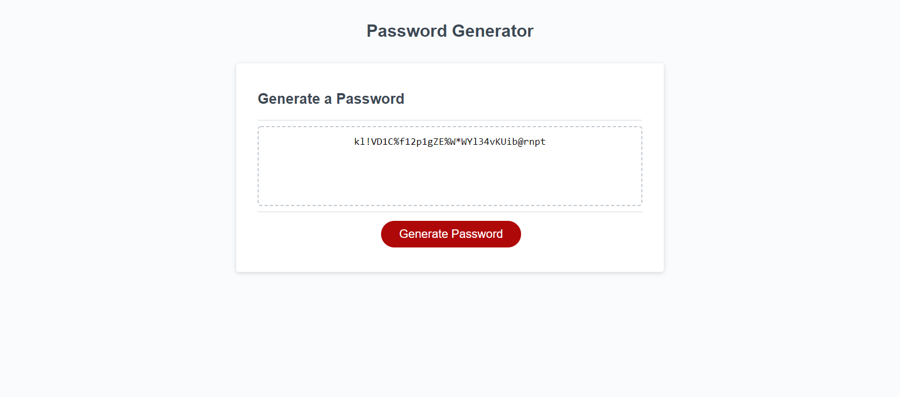

"# Password-Generator" 
# Description:
## Random Password Generator
 

### Within this website, there is one password generator button in the center of the screen.

### When clicked, a prompt will appear asking for a number of at least 8 and less than 128.
#### If the number is not at least 8 and less than 128, a prompt will appear stating "Password must be a number of at least 8 and less than 128 characters."
 

#### If the number is at least 8 and less than 128, a new prompt will appear asking if the user would like to include special characters.
 

#### A prompt will appear asking:
* Would you like to include special characters?
* Would you like to include numbers?
* Would you like to include uppercase letters?
* Would you like to include lowercase letters?
#### Each criteria can either be accepted "ok" or denied "cancel"
 

### If all character criteria has been denied "cancel" then a new promp will appear stating that "Password must include at least one criteria" and the sequence will restart.
 

### One character criteria has been decided, then a password will appear in the 'Password' box based on the inputs provided.
 

### The password generator can be restarted after a password has been generated.

# Screenshot Below:

 
 

# URL Links:
 
## Password Generator: https://morganegilbert.github.io/Password-Generator/
